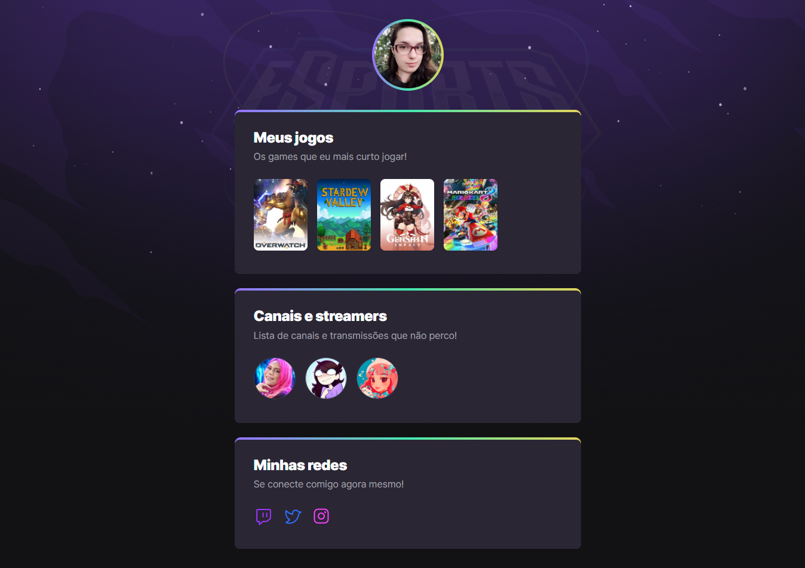

# 👾 NLW eSports
> Trilha Explorer

Projeto construído no evento Next Level Week da Rocketseat.

[🔗 Clique aqui para acessar](https://amarilisc.github.io/nlw-esports-explorer/)

## ⚙️ Tecnologias

- HTML
- CSS
- Git e Github

## Sobre o projeto
Este projeto foi concluído durante a NLW eSports, um projeto oferecido pela [@Rocketseat](https://github.com/Rocketseat), ministrado por [@Mayk Brito](https://github.com/maykbrito). O evento durou 1 semana e foi recheado de muito conteúdo! Aprendi não só com o professor mas também com a comunidade do discord, foi uma troca giganstesca de ensinamentos. O que me deixou com mais vontade de aprender.
Agradeço demais pela oportunidade!

## 💌 Contato
[Linkedin](https://www.linkedin.com/in/amarilis-caccia-75268096/)